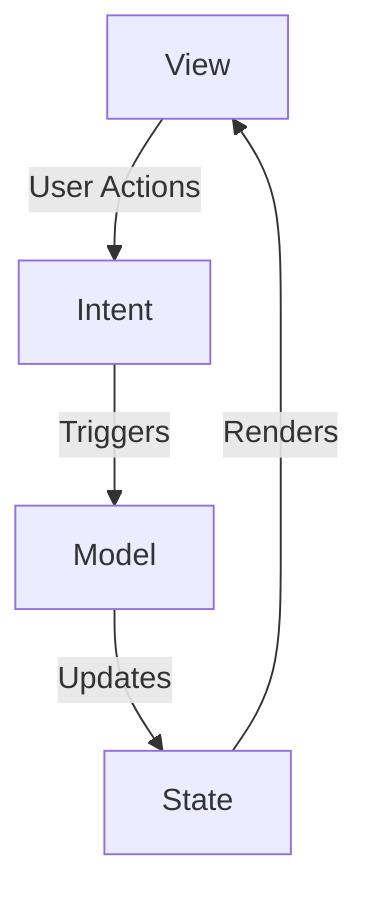

# Roadmap (FA|Compose-B|Android-C)

Ниже представлена Roadmap к начинающему android разработчику со списком материалов к изученю.

## Kotlin

 - C3
	1.  Основные операторы
	2.  Типы данных
	3.  Модификаторы доступа
	4.  Статичные данные
	5.  Базовые знания ООП
- C2
	1.  Поверхностное понимание Collection
	2.  Kotlin classes hierarchy: Any, Nothing, Unit
	3.  Null Safety: введение в функции нулевой безопасности Kotlin, типы, допускающие значение null, и безопасные вызовы.
- C1 
	1.  спользование фичей kotlin таких как: extensions, object, let - run - apply, sealed class
	2.  Знание сложных коллекций, как: Map, Queue, их реализаций в kotlin и где их использовать
	3.  Работа с коллекциями: sort, map

## Multithreading

### C3
1.   **Основы многопоточности**
    -   Основные концепции многопоточности: потоки, процессы, контексты.
    -   Создание потоков в Kotlin с помощью `Thread` и `Runnable`.
    -   Основные методы управления потоками: `start()`, `join()`, `sleep()`.
2.   **Основы корутин**
    -   Что такое корутины и зачем они нужны.
    -   Основные операторы корутин: `launch`, `async`.
    -   Базовые понятия: `Job`, `Deferred`, `CoroutineScope`.
3.   **Основные механизмы синхронизации**
    -   Понимание проблемы гонок (race conditions).
    -   Использование синхронизированных блоков и `ReentrantLock`.
    -   Основные инструменты синхронизации: `Mutex`, `Semaphore`.
### C2
1.   **Работа с корутинами в Android**
    -   Использование `CoroutineScope` в Activity и Fragment.
    -   Жизненный цикл корутин в Android: `viewModelScope`, `lifecycleScope`.
    -   Обработка ошибок в корутинах: `try-catch`, `exception handler`.
2.   **Работа со структурами данных в многопоточности**
    -   Понимание потокобезопасных коллекций: `ConcurrentHashMap`, `CopyOnWriteArrayList`.
    -   Использование `Dispatchers`: `Default`, `IO`, `Main`.
    -   Работа с `Channel` для межпоточной коммуникации.
3.   **Управление контекстом корутин**
    -   Контексты и диспетчеры корутин.
    -   Работа с `withContext`.
    -   Понимание структурных корутин: `SupervisorJob`, `coroutineScope`.
### C1 
1.   **Расширенные возможности корутин**
    -   Использование `Flow` для асинхронных потоков данных.
    -   Комбинирование корутин и Flow: `collect`, `map`, `filter`.
    -   Преобразование Flow: `flatMapConcat`, `flatMapMerge`, `flatMapLatest`.
2.   **Производительность и отладка**
    -   Оптимизация работы корутин и многопоточности.
    -   Отладка корутин и потоков: `Debug Probes`, `trace`.
    -   Анализ производительности с помощью инструментов профилирования.
3.   **Асинхронное программирование**
    -   Понимание асинхронных потоков данных.
    -   Использование `RxJava` в сочетании с корутинами.
    -   Интеграция корутин с традиционными коллбэками.

## Compose

-   **Анимации**
    -   Создание простых анимаций с использованием `animate*AsState`
    -   Введение в `Transition` и `UpdateTransition`
    -   Создание сложных анимаций и анимированных компонентов
-   **Управление жестами**
    -   Обработка пользовательских жестов с помощью `pointerInput`
    -   Использование `Modifier` для добавления жестов
    -   Введение в `GestureDetector` и обработку сложных жестов
-   **Оптимизация производительности**
    -   Оптимизация компонентов и макетов для производительности
    -   Использование инструментов для профилирования и оптимизации
    -   Избегание повторных композиций и утечек памяти
-   **Тестирование Compose**
    -   Основы тестирования UI-компонентов в Compose
    -   Использование `ComposeTestRule` для создания тестов
    -   Тестирование состояния и взаимодействия с компонентами

## Coroutines

### C3
   - **Основные концепции**
        -   Что такое корутины
        -   Разница между потоками и корутинами
        -   Преимущества использования корутин
    -   **Создание и управление корутинами**
        -   Создание корутин с использованием `launch` и `async`
        -   Основные функции корутин: `delay`, `withContext`
        -   Запуск и завершение корутин
    -   **Скопы корутин**
        -   Понятие `CoroutineScope`
        -   Использование `GlobalScope` и `CoroutineScope`
        -   Введение в `Job` и его методы (`cancel`, `join`)

### C2
-   **Обработка исключений**
        -   Обработка исключений в корутинах с использованием `try-catch`
        -   Использование `CoroutineExceptionHandler` для глобальной обработки ошибок
        -   Поведение корутин при ошибках и отмене
- **Контексты корутин**
        -   Понимание и использование `Dispatchers` (`Main`, `IO`, `Default`, `Unconfined`)
        -   Переход между контекстами с `withContext`
        -   Создание пользовательских `CoroutineDispatcher`
-   **Структурированная конкуренция**
        -   Введение в `structured concurrency`
        -   Использование `SupervisorJob` для управления иерархией корутин
        -   Разница между `launch` и `async`

###  C1 (Advanced)
-   **Каналы и потоки**
        -   Использование `Channel` для передачи данных между корутинами
        -   Введение в `Flow` и его операторы (например, `collect`, `map`, `filter`)
        -   Разница между `Flow` и `Channel`
-   **Сложные операторы Flow**
        -   Использование операторов `flatMapConcat`, `flatMapMerge`, `flatMapLatest`
        -   Введение в `buffer`, `conflate`, `zip`
        -   Обработка ошибок в `Flow`
-   **Параллелизм и конкурентность**
        -   Параллельное выполнение задач с корутинами
        -   Использование `async` для параллельных задач
        -   Введение в `select` для выбора между несколькими корутинами

## Code Revie

###  C3 (Beginner)
-   **Основные концепции**
        -   Что такое code review и его цели
        -   Преимущества code review для разработки ПО
        -   Основные участники code review: автор, рецензент, командные члены
-   **Процедуры и инструменты**
        -   Основные процедуры code review
        -   Использование систем контроля версий (например, Git)
-   **Основные критерии оценки**
        -   Проверка синтаксических ошибок и соответствие кодстайлу
        -   Оценка читаемости и понятности кода
        -   Базовая проверка логики и функциональности

## MVI with Compose

